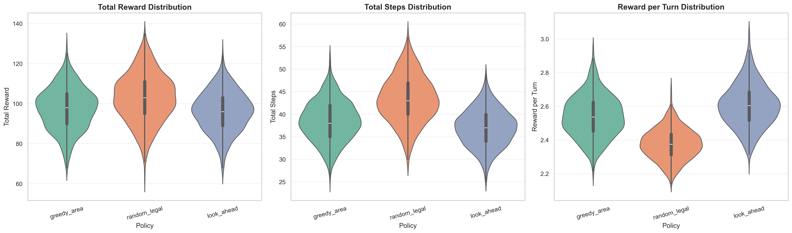
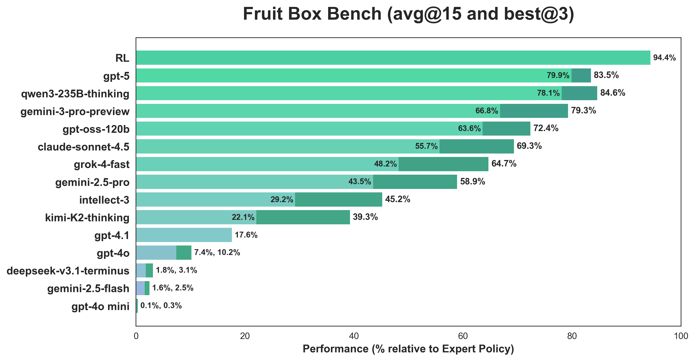

# Fruit Box Game Environment + Data Generation

A Python-based puzzle game environment for generating datasets and training RL agents.

## The Game

**Fruit Box** is a puzzle game played on a 10×17 grid:


- Each cell contains a digit from 1-9
- **Goal**: Clear as many cells as possible
- **Valid Move**: Select any rectangular region that sums to exactly 10
- **Action**: Selected cells are cleared (set to 0)
- **Game Over**: No more valid moves exist

## Quick Start

### Installation

```bash
pip install -e .
# or with uv: uv pip install -e .
```

### Generate Data

```bash
python policies/generate_dataset.py --policy <policy_name> --episodes 1000 --out_dir out_data/<name>
```

Available policies: `greedy_area`, `minimal_area`, `high_value_pairs`, `random_legal`, `look_ahead:3:20:0.95`. Output: `jsonl` (default) or `parquet` (`--format parquet`). Pre-generated data: [HuggingFace](https://huggingface.co/datasets/djdumpling/fruit-box).

## 📈 Policy Analysis

Compare policies and visualize performance:

```bash
python policies/policy_analysis.py
```

Generates `out_data/analysis/policy_comparisons.png`:



## 🤖 Reinforcement Learning

Complete RL pipeline achieving **94.4% performance** (top benchmark result). Two-stage training:

### Stage 1: Supervised Fine-Tuning (SFT)

Trains a CNN policy network on expert demonstrations to learn action legality. Uses set-based losses to penalize all illegal actions simultaneously and includes negative examples for robust legality learning.

```bash
python rl/train/train_sft.py --dataset-name djdumpling/fruit-box
```

### Stage 2: Group Relative Policy Optimization (GRPO)

Fine-tunes the SFT policy with RL using a two-phase approach:
- **Phase 0 (PPO)**: Stabilizes the policy with conservative updates
- **Phase 1 (GRPO)**: Learns optimal strategy by comparing groups of actions sampled from the same anchor point, using relative advantages rather than absolute rewards

```bash
python rl/train/train_grpo.py --load-checkpoint artifacts/sft-checkpoint-epoch-120:v3/policy_sft_epoch120.pt
```

**Key features:**
- CNN policy network with sum prediction head
- Custom Gym environment wrapper with two-phase action space (anchor selection + extent selection)
- Curriculum learning and exploration scheduling
- Wandb integration for experiment tracking

## Benchmark Results

Model and policy performance comparison:



## Dataset Merging

Combine policy datasets into HuggingFace format:

```bash
python policies/merge_to_hf.py
```

Outputs `out_data/hf_dataset/train/train.parquet` and `out_data/hf_dataset/episodes.jsonl` from all `trajectories.parquet` files in `out_data/`.

## 📁 Project Structure

```
fruit-box-env/
├── policies/               # Data generation and analysis
│   ├── generate_dataset.py
│   ├── policy_analysis.py
│   └── merge_to_hf.py
├── rl/                     # RL training pipeline
│   ├── train/              # SFT, GRPO, Q-learning
│   ├── algo/               # PPO, GRPO algorithms
│   ├── models/             # Policy network
│   ├── envs/               # Gym wrappers
│   └── eval.py
├── out_data/               # Generated datasets and analysis
└── README.md
```