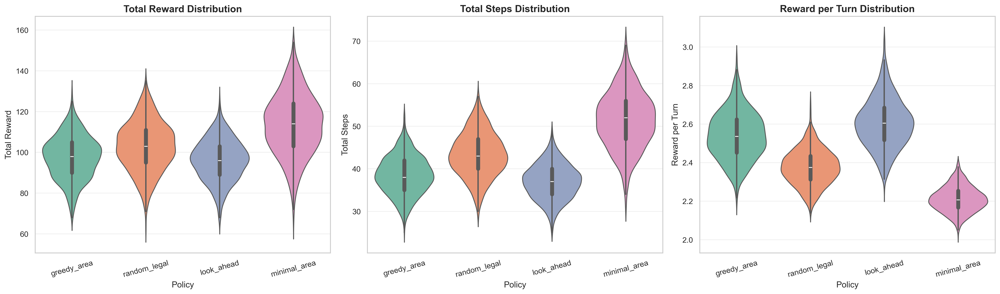

# Fruit Box Game Environment + Data Generation

A Python-based puzzle game environment for generating datasets and training RL agents.

## The Game

**Fruit Box** is a puzzle game played on a 10×17 grid:


- Each cell contains a digit from 1-9
- **Goal**: Clear as many cells as possible
- **Valid Move**: Select any rectangular region that sums to exactly 10
- **Action**: Selected cells are cleared (set to 0)
- **Game Over**: No more valid moves exist

## Quick Start

### Installation

```bash
pip install numpy pandas matplotlib seaborn tqdm pyarrow
```

### Generate Data

Generate episodes using different policies:

```bash
# Greedy policy (maximize cells cleared per move)
python generate_dataset.py --policy greedy_area --episodes 1000 --out_dir out_data/greedy_1k

# Minimal policy (minimize cells cleared per move - opposite of greedy)
python generate_dataset.py --policy minimal_area --episodes 1000 --out_dir out_data/minimal_1k

# High-value pairs policy (prioritize (9,1), (8,2), (7,3) pairs first)
python generate_dataset.py --policy high_value_pairs --episodes 1000 --out_dir out_data/high_value_1k

# Random policy
python generate_dataset.py --policy random_legal --episodes 1000 --out_dir out_data/random_1k

# Look-ahead policy (3-step depth, sample 20 moves, discount 0.95)
python generate_dataset.py --policy look_ahead:3:20:0.95 --episodes 1000 --out_dir out_data/lookahead_1k
```

**Output formats**: `jsonl` (default) or `parquet`

```bash
# Generate as parquet
python generate_dataset.py --policy greedy_area --episodes 100 --format parquet
```

## 📈 Policy Analysis

Compare multiple policies and visualize their performance:

```bash
python policy_analysis.py
```

This generates `out_data/analysis/policy_comparisons.png` with distribution comparisons:



## Dataset Merging

Combine multiple policy datasets into HuggingFace-compatible format:

```bash
python merge_to_hf.py
```

**Output:**
- `out_data/hf_dataset/train/train.parquet` - All trajectories combined
- `out_data/hf_dataset/episodes.jsonl` - Episode-level metadata

The merged dataset includes trajectories from all policies found in `out_data/` with `trajectories.parquet` files.

## 📁 Project Structure

```
fruit-box-env/
├── generate_dataset.py    # Main data generation script
├── policy_analysis.py     # Policy comparison and visualization
├── merge_to_hf.py          # Dataset merging for HuggingFace
├── out_data/               # Generated datasets
│   ├── greedy_1k/          # Greedy policy episodes
│   ├── random_1k/          # Random policy episodes
│   ├── lookahead_1k/       # Look-ahead policy episodes
│   ├── analysis/           # Policy comparison plots
│   └── hf_dataset/         # Merged HuggingFace dataset
└── README.md
```